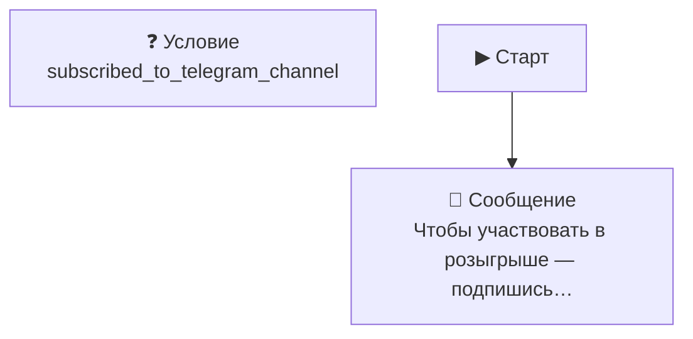

# Подписка на канал

Проверка подписки на Telegram-канал для участия в розыгрыше.

## Схема

```mermaid
flowchart TD
  s1["❓ Условие<br/>subscribed_to_telegram_channel"]
  s2["▶ Старт"]
  s3["💬 Сообщение<br/>Чтобы участвовать в розыгрыше — подпишись…"]
  s2 --> s3
```

Полная выгрузка блоков — в соседнем `.json` (секреты заменены плейсхолдерами).
